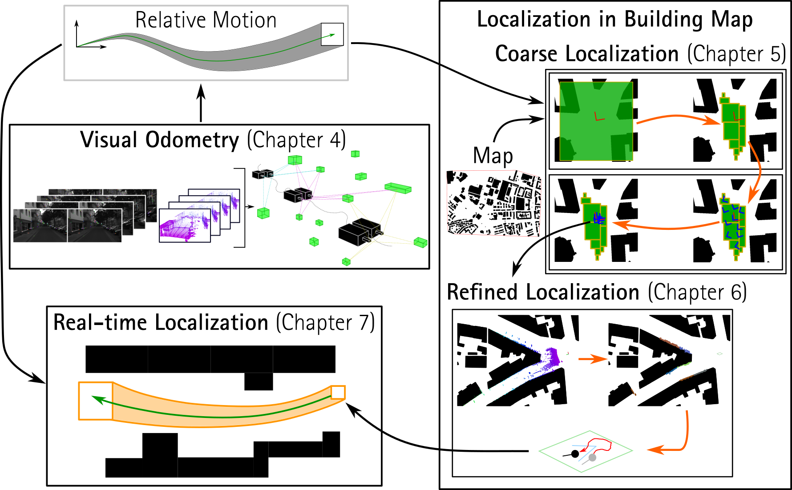
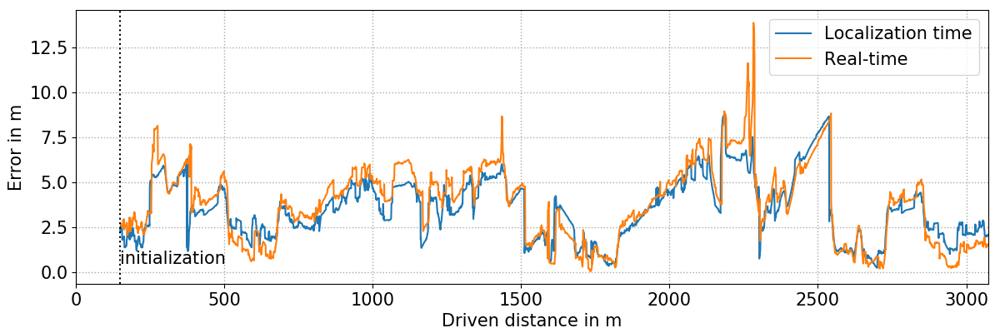
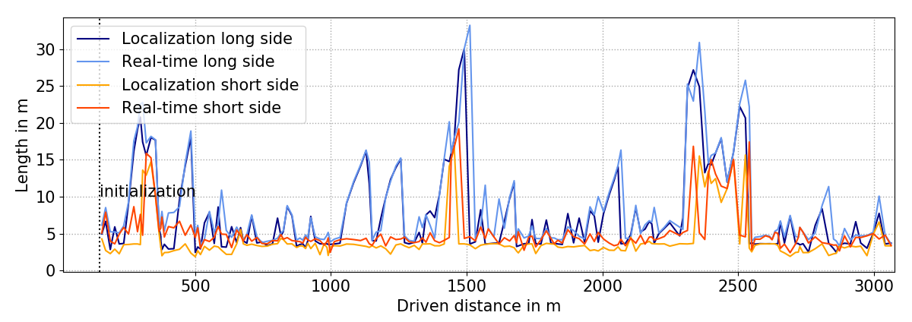
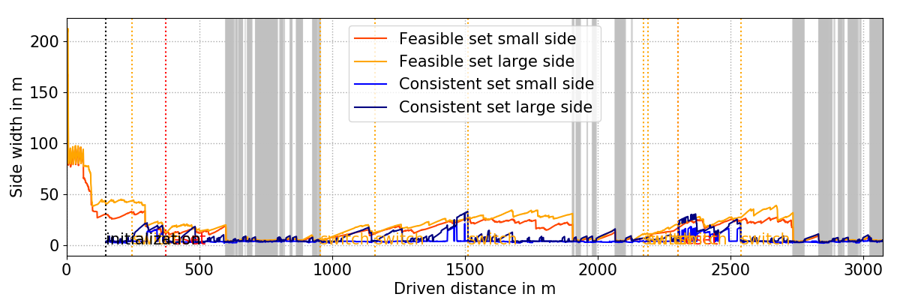
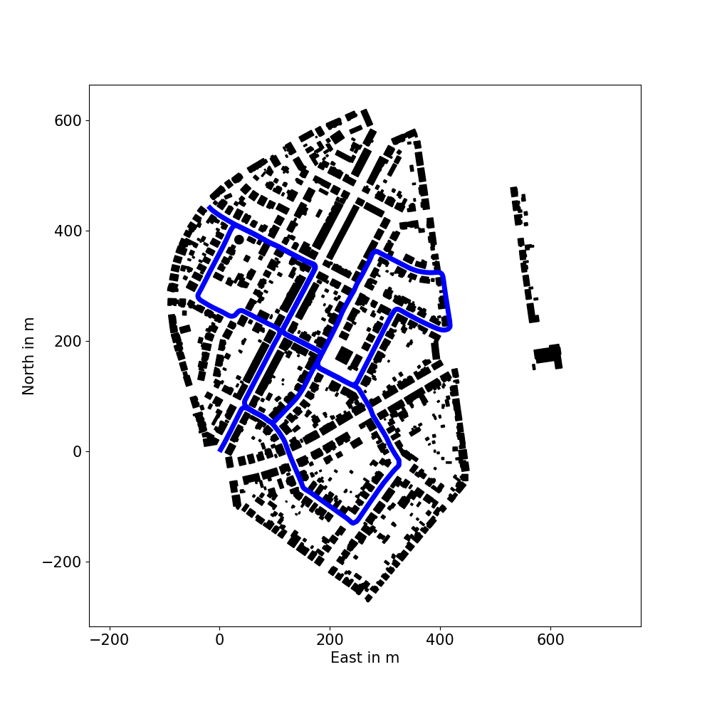
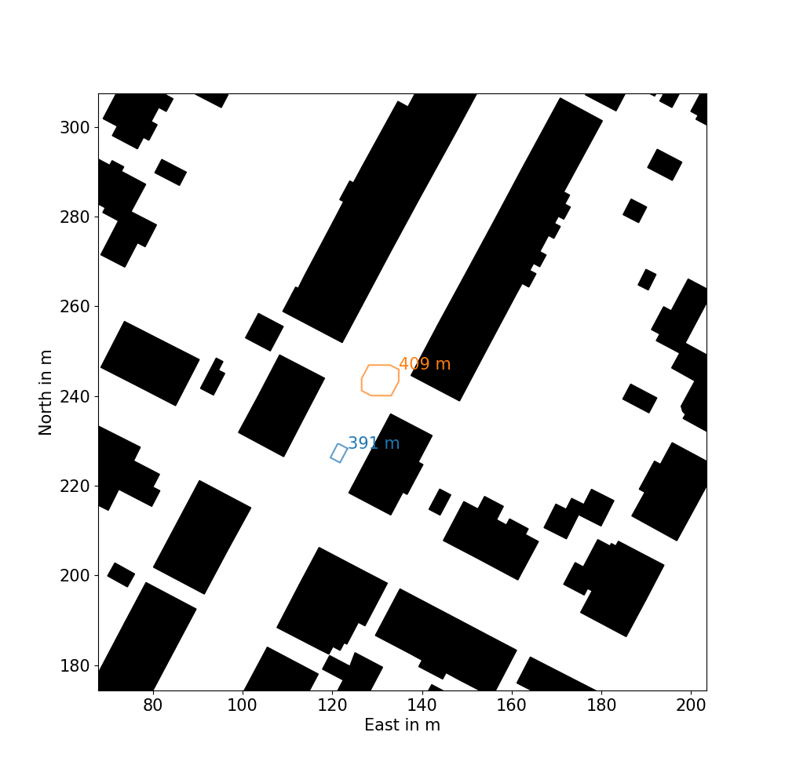
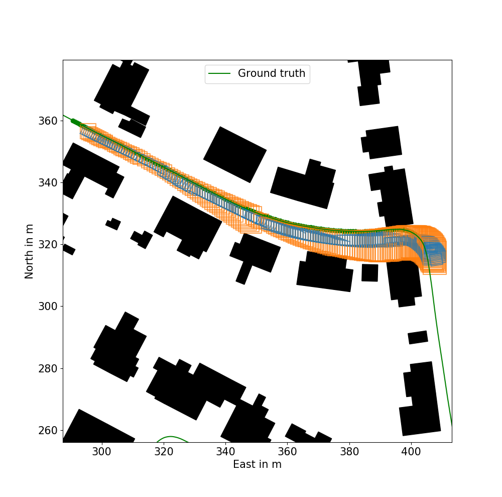

# <a name="HyPaSCoRe-Localization"></a>HyPaSCoRe Localization
This repository contains the implementation of the **Hy**brid **P**robabilistic **a**nd **S**et-Membership-based **Co**arse and **Re**fined (HyPaSCoRe) Localization. This method localizes a robot in a building map in real-time and considers two types of hybridizations. First, set-membership approaches are used to robustify and control probabilistic approaches. Second, probabilistic approaches are used to reduce the pessimism of set-membership approaches by augmenting them with further probabilistic constraints. 

Play the teaser [video](readme/hypascore_localization_example.mp4):
<a name="teaser_video"></a>

https://github.com/AaronEhambram/hypascore_localization/assets/133852603/d684f4c2-32e8-488d-b0f1-aa21c025646b

The method consists of three modules as shown in the [figure](#overview) – visual odometry, coarse localization, and refined localization. The HyPaSCoRe Localization uses a stereo camera system, a LiDAR, and GNSS data, focusing on localization in urban canyons where GNSS data can be inaccurate.

<a name="overview"></a><p align="center">

</p>

The visual odometry module computes the relative motion of the vehicle. In contrast, the coarse localization module uses set-membership approaches to narrow down the feasible set of poses and provides the set of most likely poses inside the feasible set using a probabilistic approach. The refined localization module further refines the coarse localization result by reducing the pessimism of the uncertainty estimate by incorporating probabilistic constraints into the set-membership approach.

### Table of Contents
1. [Introduction](#HyPaSCoRe-Localization)
2. [Dependencies](#Dependencies)
3. [Build](#Build)
4. [How to run](#How-to-run)
5. [Troubleshooting](#Troubleshooting)
6. [Publication](#Publication)
7. [License](#License)

## <a name="Dependencies"></a>Dependencies
The code is tested on Ubuntu 18.04 with ROS melodic and on Ubuntu 20.04 with ROS noetic. Note that you need to select the right branch depending on which distribution you are using. The main branch is dedicated for Ubuntu 20.04 with ROS noetic.

You need to install the following frameworks/libraries:
1. [Installl ROS](http://wiki.ros.org/noetic/Installation/Ubuntu)
2. [Install CUDA](https://docs.nvidia.com/cuda/cuda-installation-guide-linux/index.html): We recommend the [deb (local) installation](https://developer.nvidia.com/cuda-downloads?target_os=Linux&target_arch=x86_64&Distribution=Ubuntu&target_version=20.04&target_type=deb_local). Do not forget to export  the `PATH` and `LD_LIBRARY_PATH`. For example you can add the following lines to the .bashrc:
```bash
export PATH="/usr/local/cuda-12.1/bin:$PATH"
export LD_LIBRARY_PATH="/usr/local/cuda-12.1/lib64:$LD_LIBRARY_PATH"
```
3. [Install OpenCV](https://github.com/opencv/opencv) with [opencv_constrib](https://github.com/opencv/opencv_contrib), TBB and CUDA. Enable WITH_CUDA and WITH_TBB and specify the opencv_contrib/modules path.
```bash
cd <opencv_build_directory>
cmake -DOPENCV_EXTRA_MODULES_PATH=<opencv_contrib>/modules -DWITH_CUDA=ON -DWITH_TBB=ON <opencv_source_directory>
make -j8
```
4. [Install IBEX](https://github.com/lebarsfa/ibex-lib/tree/actions): The last version of the unofficial development repository can be found [here](https://github.com/lebarsfa/ibex-lib/tree/actions). Further installation remarks can be found in the [Codac documentation](http://codac.io/install/01-installation-full-linux.html).
```bash
sudo apt-get install -y g++ gcc flex bison cmake git libeigen3-dev # Requirements to compile IBEX and Codac
git clone -b actions https://github.com/lebarsfa/ibex-lib.git # Download IBEX sources from GitHub
# Configure IBEX before installation
cd ibex-lib
mkdir build && cd build
cmake ..
# Building + installing
make
sudo make install
cd ../..
```
5. [Install Codac](https://github.com/codac-team/codac): Follow the instructions on the [offical Codac page](http://codac.io/install/01-installation-full-linux.html).
```bash
# The codac directory can be placed in your home, same level as IBEX
git clone https://github.com/codac-team/codac   # download the sources from GitHub
cd codac                                        # move to the Codac directory
git submodule init ; git submodule update       # get pybind11 submodule
mkdir build ; cd build ; cmake .. ; make        # build the sources
sudo make install                               # install the library
cd ..
```
6. [Install g2o](https://github.com/RainerKuemmerle/g2o): Here we also recommend the out of source build. The commit id to the g2o version that we use is given in the following.
```bash
git clone https://github.com/RainerKuemmerle/g2o.git  # download the sources from GitHub
cd g2o
git checkout 14b8af0bcbcee2c33fe82d7ba7ce276ba90d43ac # specific commit id
mkdir build ; cd build ; cmake .. ; make    # build the sources
sudo make install                           # install the library
cd ..
```


## <a name="Build"></a>Build
The package has to be built as a catkin-package (ROS1). Locate the repository in the `src`-folder of the catkin workspace:
```bash
cd path/to/catkin_ws/src
git clone https://github.com/AaronEhambram/hypascore_localization.git
cd ..
catkin_make
```
Depending on how you installed OpenCV, you may have to modify the CMakeLists.txt to specify OpenCV_DIR. 
```cmake
set(OpenCV_DIR path/to/opencv-4.7.0/install)
```

## <a name="How-to-run"></a>How to run
The current implementation reads a rosbag and performs the localization offline at sensor rate. However, based on the script, you can use the approach also online providing the PoseEstimationSystem class the sensor data directly. To showcase the HyPaSCoRe Localization we first introduce a [quick start example](#quick-start). Furthermore, we provide [custom evaluation scripts](#evaluation).  We also provide [map parsers](#map-parsers) so that you can generate your own .map-file for the regions you want to use our approach. The custom .map-file can be generated from .osm and .gml files. As we use contractors to deal with the set-membership-based uncertainty representation, we also provide interactive exemplary test-files to provide an intuitive understanding of how the custom contractors work using the [codac library](http://codac.io/).
### <a name="quick-start"></a>Quick Start with an Exemplary KITTI Trajectory
For a quick start we provide a preprocessed rosbag of the [KITTI 2011_10_03_drive_0027 raw data](https://www.cvlibs.net/datasets/kitti/raw_data.php?type=residential), the calibration data and the map. You can download the data [here](https://seafile.cloud.uni-hannover.de/d/13383f8fe90c4f73a3cb/). To start the example, the launch-file needs to be modified to specify the location of the downloaded data. Therefore, you need to edit `launch/hypascore_localization_0027kitti.launch`: 

1.  Specify the rosbag location in line 2.
```xml
<arg name="rosbags_list" default="[/path/kitti_0027.bag]"/>
```
2. Specify the calibration folder location in line 13. Note that in this folder there are two files (extrinsics.xml and intrinstics.xml).
```xml
<param name="calibration_folder" type="string" value="/path/calibration_data/"/>
```
3. Specify the map location in line 14.
```xml
<param name="city_model_file" type="string" value="/path/0027_map_small.map"/>
```
Now the launch file is ready to start the demo with
```bash
roslaunch hypascore_localization hypascore_localization_0027kitti.launch
```
As shown in the [video above](#teaser_video), the visualizations will pop up.

### <a name="evaluation"></a>Evaluation
During the execution of the HyPaSCoRe Localization, results files can be dumped. We plot the results using the python scripts located in `src/evaluation`. To dump the output files, the launch file need to be configured accordingly. To obtain the overall-results files, the destination files need to be specified in the launch file in line 22 to 24.
```xml
<param name="file_gt_poses" type="string" 	value="path/gt_traj.txt"/> 
<param name="file_overall_results" type="string" 	value="path/out.txt"/> 
<param name="file_overall_only_rt_results" type="string" 	value="path/out_rt.txt"/> 
```
After starting the launch file, the results will be dumped to the specified files. To visualize evaluation results, a configuration-files has to be edited. We already provide the configuration files in `src/evaluation/overall_cfgs`. For the exemplary KITTI trajectory you need to modify the first three lines of `0027kitti.txt`.
```txt
results_file:/path/out.txt
rt_only_results_file:/path/out_rt.txt
gt_trajectory_file:/path/gt_traj.txt
...
```
Now you can call the python evaluation script `src/evaluation/overall_evaluate.py` providing the configuration file as an argument.
```bash
./overall_evaluate.py /path/src/evaluation/0027kitti.txt
```
The evaluation plots ([matplotlib](https://matplotlib.org/)) will pop up.

  
  

### <a name="map-parsers"></a>Download Maps and Parsers
The building map needs to be downloaded beforehand. For the demo, the .map-file can be downloaded. We use a custom .map-file that needs to be generated. Therefore we provide parsers that parse, for instance, .osm-files to our custom format. The parsers can be found in `src/map_tools`. To obtain the building map to any region we recommend to download the [OpenStreetMap](https://www.openstreetmap.org/#map=6/51.330/10.453) file. [JOSM](https://josm.openstreetmap.de/) is a very handy tool for that. You can download the application by
```bash
sudo apt-get install josm
```   
In JOSM the region of interest can be selected and the .osm-file can be downloaded. 

To generate the .map-file from the .osm, line 10 needs to be modified to specify the destination file and in line 14 you need to specify the input osm file. Then you can run the python-script. 

### Contractor Test Files
The test-files for the contractors that can be found in `src/contractors` are also built as executables. The interactive demos can be launched by starting the repective nodes. To start the No-Cross Contractor (left) and Polygon Separator (right) demos you need to type the following commands:
```bash
rosrun i_vil_slam_in_map test_ctcnocross_node
rosrun i_vil_slam_in_map test_seppolygon_node
``` 
Then you will see the interactive visualizations.


## <a name="Troubleshooting"></a>Troubleshooting
- When .so-files are not found, extend the `LD_LIBRARY_PATH` by editing the .bashrc-file. For instance, I had linking errors during runtime with opengl_helper. 
```bash
export LD_LIBRARY_PATH="/usr/local/lib:$LD_LIBRARY_PATH" 
```
- cudawarping.cpp handles _M in line 186 incorrectly. Our workaround is to exchange the line 186 by the following
```c++
GpuMat __M = _M.getGpuMat();
Mat M;
__M.download(M);
```
- We are using [cv_bridge](https://github.com/ros-perception/vision_opencv/tree/rolling/cv_bridge) to convert the sensor_msgs to cv::Mat. If you have built OpenCV locally, you should rebuild the cv_bridge-package in your catkin-workspace with the locally built OpenCV version to avoid version mismatches.

- If you have multiple packages that link to IBEX, the `Ibex::ibex` target may not be available to all packages (only the first package that adds the target). Using `catkin build` this problem can be avoided. 

## <a name="Publication"></a>Publication
This work combines multiple publications which present different parts. Depending on which part you use in your academic work, please cite the corresponding publications.
### Visual Odometry
This [paper](https://ieeexplore.ieee.org/abstract/document/9551516) introduces the stereo-visual-LIDAR fusion:
```bibtex
  @InProceedings{ehambram2021case,
    author    = {Ehambram, Aaronkumar and Voges, Raphael and Wagner, Bernardo},
    booktitle = {2021 IEEE 17th International Conference on Automation Science and Engineering (CASE)},
    title     = {Stereo-Visual-LiDAR Sensor Fusion Using Set-Membership Methods},
    year      = {2021},
    month     = {Aug},
    pages     = {1132-1139},
    doi       = {10.1109/CASE49439.2021.9551516},
    issn      = {2161-8089}
  }
```
This [paper](https://ieeexplore.ieee.org/abstract/document/9812425) presents the visual odometry approach used in the HyPaSCoRe Localization: 
```bibtex
@InProceedings{ehambram2022icra,
  author    = {Ehambram, Aaronkumar and Voges, Raphael and Brenner, Claus and Wagner, Bernardo},
  booktitle = {2022 International Conference on Robotics and Automation (ICRA)},
  title     = {Interval-based Visual-Inertial LiDAR SLAM with Anchoring Poses},
  year      = {2022},
  month     = {May},
  pages     = {7589-7596},
  doi       = {10.1109/ICRA46639.2022.9812425},
}
```
### Coarse Localization
In the [abstract](https://www.repo.uni-hannover.de/bitstream/handle/123456789/13326/Ehambram_etal_SWIM22.pdf?sequence=1) the core idea of the coarse localization is presented:
```bibtex
@Article{ehambram2022wim,
  author    = {Ehambram, Aaronkumar and Jaulin, Luc and Wagner, Bernardo},
  journal   = {SWIM 2022},
  title     = {Interval-based Global Localization in Building Maps},
  year      = {2022},
  publisher = {Hannover: Gottfried Wilhelm Leibniz Universit{\"a}t},
  url = {https://www.repo.uni-hannover.de/bitstream/handle/123456789/13326/Ehambram_etal_SWIM22.pdf?sequence=1}
}
```
Main paper is currently under review.

### Refined Localization
The refined localization is presented in this [paper](https://ieeexplore.ieee.org/abstract/document/9793707):
```bibtex
@Article{ehambram2022ral,
  author   = {Ehambram, Aaronkumar and Jaulin, Luc and Wagner, Bernardo},
  journal  = {IEEE Robotics and Automation Letters},
  title    = {Hybrid Interval-Probabilistic Localization in Building Maps},
  year     = {2022},
  issn     = {2377-3766},
  month    = {July},
  number   = {3},
  pages    = {7059-7066},
  volume   = {7},
  doi      = {10.1109/LRA.2022.3181371}
}
```

### HyPaSCoRe Localization: Full System Overview
The PhD thesis will be published soon.

## <a name="License"></a>License
Copyright 2023, Aaronkumar Ehambram, Luc Jaulin, Simon Rohou, Bernardo Wagner, Institute for Systems Engineering - Real-Time Systems, Leibniz Unversität Hannover.

This project is free software made available under the MIT License. For details see the LICENSE file.
